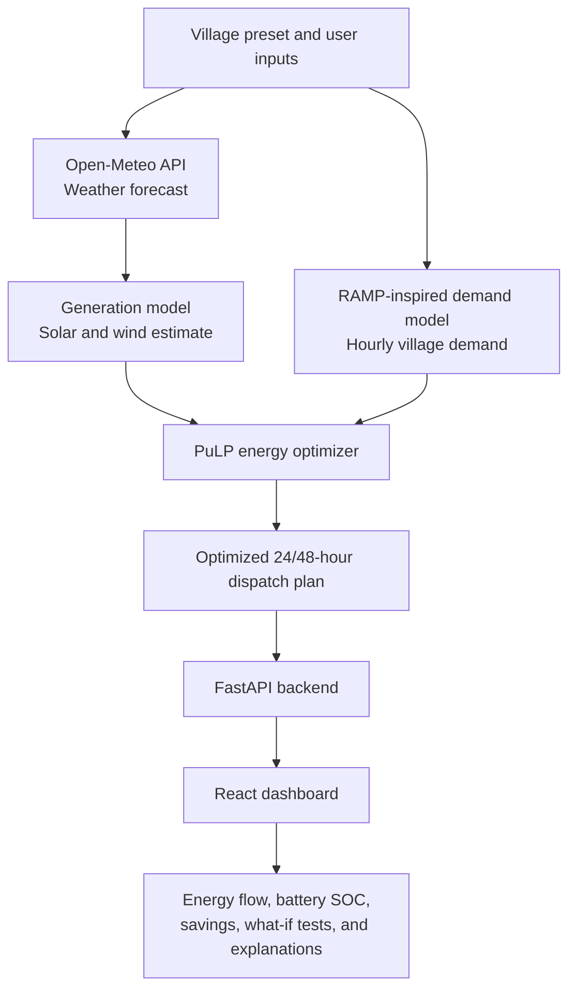

# PowerLoom

PowerLoom helps off-grid villages plan their electricity use more intelligently. It predicts the next 24 or 48 hours of solar and wind energy, estimates village demand, and creates the most efficient plan for using solar, wind, batteries, and diesel generators.

The goal is simple: keep essential services powered while reducing diesel use, cost, and carbon emissions.

## The problem

Many remote villages depend on a mix of solar panels, wind turbines, batteries, and diesel generators. Renewable energy changes with the weather, while electricity demand changes throughout the day. Without a clear plan, operators may use too much diesel, waste renewable energy, or risk shortages during peak hours.

PowerLoom turns weather and village data into an easy-to-understand energy plan so operators can decide when to store energy, use renewables, run the generator, or protect critical loads.

## How the system works

```text
Village settings + weather forecast
             |
             v
Estimate solar/wind generation and hourly demand
             |
             v
Optimize the energy mix for the next 24 or 48 hours
             |
             v
Compare it with normal operating strategies
             |
             v
Show the plan, savings, battery status, and explanations on the dashboard
```

1. The user selects a village preset and can change conditions such as cloud cover, diesel price, solar capacity, battery capacity, or generator availability.
2. The backend gets a weather forecast and estimates solar and wind production.
3. It builds an hourly demand profile for homes and essential services such as health, water, and street lighting.
4. The optimizer creates the best dispatch plan, prioritising renewable energy and battery use while keeping critical demand protected.
5. The dashboard displays hourly energy flow, battery state of charge, savings, baseline comparison, and a plain-language explanation of each decision.

## Key features

- **Forecast-based planning:** Uses weather data to prepare for changing solar and wind availability.
- **Smart energy optimization:** Finds a cost- and emission-conscious mix of solar, wind, battery, and diesel.
- **Critical-load protection:** Prioritises essential village services during limited supply.
- **24/48-hour dispatch plan:** Shows what energy source should be used in every hour.
- **What-if simulator:** Test cloudy weather, higher diesel prices, extra solar panels, larger batteries, or generator failure.
- **Savings comparison:** Compares the optimized plan with standard dispatch methods to show diesel, cost, and CO2 savings.
- **Visual dashboard:** Includes energy-flow diagrams, energy mix charts, battery SOC tracking, timelines, and run history.
- **Simple explanations:** Explains why the system made important decisions in English, Gujarati, and Hindi.
- **Offline-friendly fallback:** Can use generated forecast data and a local SQLite database when online services are unavailable.

## System architecture and flow



The system combines village configuration and user-selected scenarios with live weather data from the **Open-Meteo API**. A **RAMP-inspired demand model** estimates hourly electricity needs, while the **PuLP optimizer** decides the best use of solar, wind, battery storage, and diesel generation. The final plan is sent to the dashboard for simple visual analysis.

## Tech stack

- **Frontend:** React, TypeScript, Vite, Tailwind CSS
- **Backend:** Python, FastAPI, SQLModel
- **Optimization:** PuLP with CBC/HiGHS solver support
- **Data & AI:** Open-Meteo weather API and optional Google Gemini explanations
- **Demand modelling:** RAMP-inspired hourly demand model
- **Database:** SQLite by default, with PostgreSQL support

## Run locally

### Prerequisites

- Node.js 18 or newer
- Python 3.11 or newer
- npm

### 1. Start the backend

Open a terminal in the project folder:

```powershell
cd backend
python -m venv .venv
.\.venv\Scripts\Activate.ps1
pip install -r requirements.txt
uvicorn app.main:app --reload --port 8000
```

On macOS/Linux, activate the environment with:

```bash
source .venv/bin/activate
```

The backend runs at `http://localhost:8000`. You can verify it at `http://localhost:8000/api/health`.

### 2. Start the frontend

Open a second terminal in the project folder:

```powershell
cd frontend
npm install
npm run dev
```

Open the URL shown by Vite, usually `http://localhost:5173`.

The frontend automatically sends API requests to the backend running on port 8000.

### Optional: run the UI with demo data

If you want to work on the frontend without starting the backend, create `frontend/.env` with:

```env
VITE_USE_MOCK=true
```

Restart `npm run dev` after changing this value. Set it to `false` (or remove it) to use the live backend again.

### Useful commands

```powershell
# Frontend checks (run inside frontend)
npm run lint
npm test
npm run build

# Backend tests (run inside backend with the virtual environment activated)
pytest
```

## Project structure

```text
PowerLoom/
|-- frontend/     # React dashboard and visualizations
`-- backend/      # FastAPI APIs, forecasts, demand model, and optimizer
```

## Team

- Jashkumar Baldha
- Anshkumar Darji
- Krrish Bhardwaj
- Vedant Bhatt
