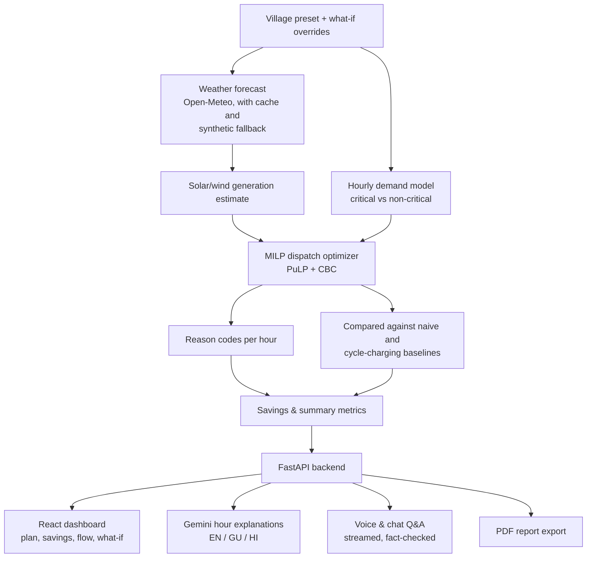
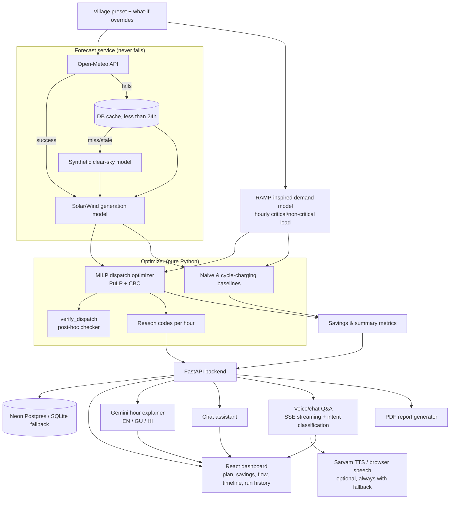

# PowerLoom

PowerLoom is a forecast-driven energy mix optimizer for off-grid village microgrids.

- Predicts the next 24 or 48 hours of solar and wind energy from weather forecasts
- Estimates hourly village electricity demand, appliance by appliance
- Computes a mathematically optimal dispatch plan across solar, wind, battery, and diesel
- Explains that plan in plain language — English, Gujarati, or Hindi — by text, chat, or voice
- **Goal:** keep essential services powered while cutting diesel use, cost, and carbon emissions

## The problem

| Without PowerLoom | With PowerLoom |
|---|---|
| Renewable output swings with the weather; demand swings through the day | Weather forecasts and an hourly demand model feed a single optimizer |
| Operators guess when to run diesel, charge the battery, or shed load | A MILP optimizer computes the lowest-cost, lowest-CO2 hourly plan |
| Too much diesel is burned, or renewable energy is wasted | Diesel, cost, and CO2 savings are quantified against real baselines |
| Peak-hour shortages risk cutting essential services (health, water, lighting) | Critical loads are protected by hard constraint, not best-effort |
| Plans are numbers on a screen, hard for operators to act on | Reason codes + plain-language, multi-language explanations (text/voice) |

## How the system works



| Step | What happens |
|---|---|
| 1 | User selects a village preset; tweaks cloud cover, diesel price, extra solar/battery, or generator availability via **what-if sliders / quick-scenario chips** |
| 2 | Backend resolves an hourly weather forecast (live API → cache → synthetic fallback — never fails) and estimates solar/wind generation |
| 3 | Hourly demand profile is built bottom-up from appliance-level components (lighting, cooling, health, water, school, commercial, street lighting), with schedule jitter, partial-hour ramps, temperature coupling, and controlled randomness |
| 4 | **MILP optimizer** (PuLP + CBC) computes the cost- and CO2-minimizing hourly dispatch across solar, wind, battery, and diesel for 24–48 hours, always protecting critical load |
| 5 | Plan is compared against two rule-based baselines (naive load-following, cycle-charging) to quantify diesel, cost, and CO2 savings |
| 6 | Every dispatch hour is tagged with **reason codes** (pre-charging ahead of a forecast deficit, efficient diesel loading, evening peak discharge, ...), turned into plain-language text (EN/GU/HI) by a Gemini-based explainer |
| 7 | React dashboard visualizes the plan (energy flow, battery SOC, savings, timeline, run history); operator can ask free-text/spoken questions (voice or chat) or export a 24-hour PDF report |

## Key features

### Forecasting & modelling
- **Never-fail weather forecasting:** Open-Meteo live data, falling back to a fresh/stale DB cache, and finally to a deterministic NOAA/Haurwitz/Kasten–Czeplak synthetic clear-sky model — the app always has a forecast.
- **Cloud-cover override:** What-if slider recomputes GHI/GTI on the fly using a physically grounded cloud attenuation formula.
- **Bottom-up demand modelling:** RAMP-inspired hourly load profile built from appliance quantity × rated power × usage windows, with day-to-day schedule jitter, smooth partial-hour ramps, temperature-coupled cooling load, dusk/dawn-driven street lighting, and realistic per-hour noise — fully deterministic given a seed.
- **System adequacy checks:** Non-blocking warnings when evening peak, total peak, or critical peak demand is at risk relative to diesel/battery capacity.

### Optimization
- **MILP dispatch optimizer:** Hour-by-hour solar/wind/battery/diesel dispatch computed with PuLP + CBC, minimizing fuel cost + CO2 penalty + battery wear + load-shed penalty, subject to power balance, battery dynamics, diesel min-load, and a no-borrowing terminal state-of-charge constraint.
- **Critical-load protection:** Non-critical load can be shed under stress; critical load is protected unless the problem is infeasible without relaxing it (rare, logged, and reported).
- **Fast what-if mode:** A lower-precision/faster solver pass keeps interactive sliders feeling instant, with a result cache so repeated scenarios resolve instantly.
- **Post-hoc verification:** Every optimized plan is independently re-checked against power balance, SOC bounds, diesel limits, and terminal SOC.
- **Rule-based baselines:** Naive load-following and cycle-charging strategies simulate "how operators run these systems today," for an apples-to-apples savings comparison.
- **Reason codes:** Every optimized hour is tagged with the dominant decision driver (forecast pre-charging, efficient diesel loading, renewables covering demand, evening peak discharge, load shedding, SOC limits, curtailment, etc).

### Explanations, chat & voice
- **Plain-language hour explanations:** A Gemini-based explainer turns reason codes into short, fact-grounded text in English, Gujarati, or Hindi.
- **Powerloom Chat Assistant:** A context-grounded chatbot that answers questions about the current plan, KPIs, and general microgrid concepts.
- **Personalized Scenario voice/chat page:** Ask free-text or spoken questions ("how much diesel will run tonight?", "is critical load safe?", "what if there's a power cut?") and get streamed, fact-checked answers.
  - Deterministic keyword-based intent classification (English/Gujarati/Hindi, Latin/Devanagari/Gujarati scripts) for common questions, with a Gemini-grounded fallback for open-ended "what if" questions.
  - Server-Sent Events streaming with an immediate intent event, live token streaming, and a post-stream numeric-accuracy validation pass that transparently swaps in a safe template answer if needed.
  - Optional Sarvam AI (Bulbul) text-to-speech with automatic fallback to the browser's built-in speech synthesis, and optional speech-to-text input via the Web Speech API — voice is always optional, typing always works.
- **Facts-only guarantee:** Every explanation and answer is grounded in the actual optimizer output — the LLM explains decisions, it never makes them.

### Dashboard & UX
- **24/48-hour dispatch plan:** Full hourly view of which energy source is used, battery SOC, and demand.
- **What-if simulator:** Sliders and quick-scenario chips (cloudy tomorrow, diesel price spike, extra solar, bigger battery, generator failure) with debounced live re-optimization and an impact summary vs the default plan.
- **Savings comparison:** Diesel litres/hours, cost, and CO2 saved vs baseline dispatch strategies.
- **Interactive energy flow diagram:** Single-hour Sankey-style view of solar/wind/battery/diesel flows into village load, curtailment, and shed load, with a playback bar to scrub through the day.
- **Run history & presets:** Every optimization run is saved; past runs (and their overrides) can be restored instantly without re-calling the API.
- **Presentation mode & keyboard shortcuts:** Distraction-free full-width mode and shortcuts for playback, hour stepping, language switching, and re-running.
- **PDF report export:** One-click 24-hour dispatch report with per-hour recommendations, generated server-side.
- **Multi-language UI:** English, Gujarati, and Hindi throughout the dashboard and explanations.
- **Offline-friendly fallback:** Works with synthetic forecast data and an automatic SQLite fallback when Neon Postgres or external APIs are unavailable; a frontend mock mode allows UI development with zero backend.

## System architecture



| Layer | Responsibility |
|---|---|
| Forecast service | Live weather from Open-Meteo, degrading through a DB cache to a physics-based synthetic model — never fails |
| Demand model | RAMP-inspired hourly electricity needs, critical vs non-critical |
| Optimizer | PuLP/CBC MILP for best solar/wind/battery/diesel dispatch, verified post-hoc, benchmarked against two rule-based baselines |
| Backend | FastAPI serves the plan, savings, explanations, chat, voice, and PDF reports |
| Frontend | React dashboard renders the plan; all explanations/chat/voice are strictly grounded in the optimizer's own output |

## Tech stack

- **Frontend:** React, TypeScript, Vite, Tailwind CSS v4, recharts, framer-motion, zustand, axios
- **Backend:** Python 3.11+, FastAPI, SQLModel, pydantic-settings, httpx
- **Optimization:** PuLP with the CBC solver
- **Weather:** Open-Meteo API, with a deterministic synthetic fallback model
- **Demand modelling:** RAMP-inspired hourly appliance-level demand model
- **AI / language:** Google Gemini (hour explanations, chat assistant, voice Q&A), optional Sarvam AI Bulbul text-to-speech, browser Web Speech API (STT/TTS)
- **Database:** Neon PostgreSQL (primary, via SQLModel/psycopg 3) with automatic in-process SQLite fallback
- **Testing:** pytest (backend, always against in-memory SQLite)

## Run locally

### Prerequisites

- Node.js 18 or newer
- Python 3.11 or newer
- npm

### 1. Start the backend

Open a terminal in the project folder:

```bash
cd backend
python3 -m venv .venv
source .venv/bin/activate
pip install -r requirements.txt
cp .env.example .env
uvicorn app.main:app --reload --port 8000
```

On Windows (PowerShell), activate the environment with:

```powershell
.\.venv\Scripts\Activate.ps1
```

- Fill in `backend/.env` with your own `DATABASE_URL` (Neon) and, optionally, `GEMINI_API_KEY` / `SARVAM_API_KEY`
- The app runs fine without any of them — it falls back to SQLite and template-based explanations
- Backend runs at `http://localhost:8000`; verify at `http://localhost:8000/api/health`

### 2. Start the frontend

Open a second terminal in the project folder:

```bash
cd frontend
npm install
npm run dev
```

- Open the URL shown by Vite, usually `http://localhost:5173`
- The dev server proxies `/api` requests to the backend on port 8000

### Optional: run the UI with demo data

If you want to work on the frontend without starting the backend, create `frontend/.env` with:

```env
VITE_USE_MOCK=true
```

- Restart `npm run dev` after changing this value
- Set it to `false` (or remove it) to use the live backend again

### Useful commands

```bash
# Frontend checks (run inside frontend)
npm run lint
npm test
npm run build

# Backend tests (run inside backend with the virtual environment activated)
pytest
```

## Project structure

```text
PowerLoom/
|-- frontend/               # React dashboard, what-if simulator, energy flow, voice/chat UI
|   `-- src/
|       |-- components/     # EnergyFlow, WhatIfPanel, SocChart, RunHistory, Chatbot, ...
|       |-- pages/          # PersonalizedScenarioPage (voice/chat Q&A)
|       |-- store/          # zustand app store (plan, overrides, run history, playback)
|       `-- types/api.ts    # TypeScript mirror of the backend Pydantic schemas
`-- backend/                # FastAPI APIs, forecast/demand services, optimizer, explainer
    `-- app/
        |-- api/routes/     # health, presets, optimize, explain, chat, voice, report, runs
        |-- services/       # forecast, demand, generation, chat, tts, report, pipeline
        |-- optimizer/      # MILP model, baselines, metrics, reason codes, verifier
        |-- explainer/      # Gemini prompts, intent classification, voice templates
        `-- schemas/        # Pydantic request/response contracts (mirrored in the frontend)
```

## Team

- Jashkumar Baldha
- Anshkumar Darji
- Krrish Bhardwaj
- Vedant Bhatt
